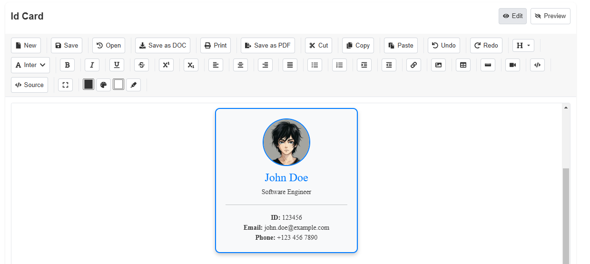

# js-text-editor

A modern, customizable rich text editor built with React and Bootstrap, offering a wide range of formatting tools, table insertion, media embedding, and document management features.




## Installation

Install the package via npm:

```bash
npm install js-text-editor
```

Ensure you have the required peer dependencies installed:

```bash
npm install react react-dom react-bootstrap bootstrap react-icons
```

Import Bootstrap CSS in your project (e.g., in index.js or App.js):

```bash
import "bootstrap/dist/css/bootstrap.min.css";
```

## Usage

Import the `JsTextEditor` component and its styles into your React application:

```bash
import React from "react";
import JsTextEditor from "js-text-editor";


function App() {
  return (
    <div>
      <h1>JS Text Editor</h1>
      <JsTextEditor />
    </div>
  );
}

export default App;

```

## Config Options

The config prop allows customization of the editor. Below are the default values:

```bash

{
  readonly: false,              // Disables editing if true
  toolbar: true,                // Shows/hides the toolbar
  toolbarSticky: true,          // Makes the toolbar sticky
  height: "500px",              // Editor height
  minHeight: "300px",           // Minimum height
  maxHeight: "500px",           // Maximum height
  overflowY: "auto",            // Scroll behavior
  buttons: [                    // Toolbar buttons (customizable)
    "new", "save", "open", "saveAsDoc", "print", "saveAsPDF",
    "cut", "copy", "paste", "undo", "redo", "heading", "font",
    "bold", "italic", "underline", "strikethrough", "superscript",
    "subscript", "alignLeft", "alignCenter", "alignRight", "alignJustify",
    "ul", "ol", "indent", "outdent", "link", "image", "table",
    "horizontalRule", "video", "code", "source", "expand"
  ]
}

```

You can override any of these by passing a config object

```bash

<JsTextEditor
  config={{
    height: "600px",
    toolbarSticky: false,
    buttons: ["bold", "italic", "link", "image"]
  }}
/>

```
