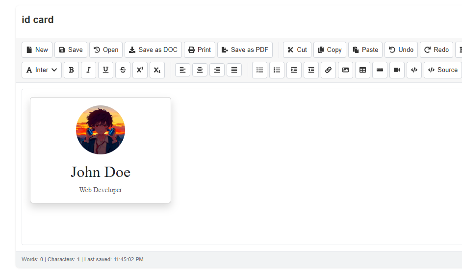

# js-text-editor

A rich text editor for React and JavaScript applications featuring a modern UI and a wide range of formatting tools, including bold, italic, tables, links, and more.



## Installation

To use `js-text-editor` in your project, install it along with its peer dependencies:

```bash
npm install js-text-editor react react-dom react-icons react-bootstrap bootstrap
```
